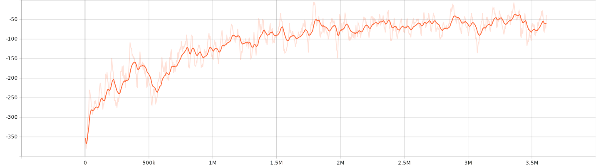

# 🧠 Durba Reinforcement Learning Agent

A **Graph Neural Network (GNN)** + **Maskable PPO** agent trained to play the **Durba** game — a node-based strategy environment where players capture and defend nodes by transferring "juice" through a dynamic directed graph.

This project integrates **Stable Baselines3**, **SB3-Contrib (Maskable PPO)**, and **PyTorch Geometric** to train reinforcement learning agents that can reason over structured graph environments.

---

## 🚀 Features

- 🧩 **Custom Graph Environment (`DurbaEnv`)** – Node/edge-based resource control system  
- 🧠 **Graph Neural Network Policy** – Implemented using a custom `GraphFeatureExtractor`  
- 🎯 **Maskable PPO** – Learns valid actions dynamically using action masks  
- 📊 **TensorBoard Logging & Checkpointing** – Automatic saving every 50K steps  
- 🎥 **Graph Visualization** – Generates live and recorded game videos with annotations  

---

## 📁 Project Structure

```
durba-rl/
│
├── train_maskppo.py # Train Maskable PPO agent
├── evaluate_agent.py # Evaluate trained model performance
├── play_game.py # Visualize and record agent gameplay
│
├── feature_extractors.py # Custom GNN feature extractor for policy
│
├── durba/
│ └── envs/
│ ├── durba_env.py # Core environment logic
│ ├── custom_monitor.py # Metric tracking and callbacks
│ ├── agent.py # Contain agent actions execution script
│ ├── rew_shaper.py # Reward Shaping
│
├── ppomask_checkpoints/ # Model checkpoints
├── outputs/ # Generated videos and logs
├── logs/ # TensorBoard logs
│
├── requirements.txt # Dependency list
└── README.md # Project documentation

```
---

## ⚙️ Installation

### 1️⃣ Clone the repository
```bash
git clone https://github.com/ianlavine/Durb-2.git
cd Durba-2/backened/durba-rl
```

---

### 2️⃣ Create a Python environment
```bash
conda create -n durba_rl python=3.12
conda activate durba_rl
```

---

### 3️⃣ Install dependencies
```bash
pip install -r requirements.txt
```

💡 PyTorch with CUDA support is already included in requirements.txt.

---

## 🧠 Training the Agent

Train the Maskable PPO agent using your custom attention based graph feature extractor:

```bash
python train_maskppo.py
```
- The environment automatically provides valid action masks.
- Model checkpoints are saved every 50,000 steps in ```ppomask_checkpoints/.```
- TensorBoard logs are saved to ``` logs/durba_maskppo_single_discrete/.```

### 📈 View Training Progress

```bash
tensorboard --logdir logs/
```



---

## 🧪 Evaluating the Agent
Run the following script to evaluate the trained model on multiple games:
```bash
python evaluate_agent.py
```

Example output:
```bash
No. of Games: 500
Win Rate: 0.84
Draw Rate: 0.05
```

You can adjust the number of games or model path inside evaluate_agent.py.

## 🎮 Visualizing Gameplay
To record a full gameplay video with live graph updates:
```bash
python play_game.py
```
This script:

- Renders the graph using Matplotlib

- Displays nodes, edges, and ownership in color

- Saves an .mp4 file and step-by-step log

### 📂 Output files:

```bash
outputs/graph_video_<timestamp>.mp4
out_logs.txt
```

## 🧑‍🔬 Future Improvements
- [ ] Add YAML config support for hyperparameters
- [ ] Add diverse bot with different personalities to make agent learning better  
- [ ] Add self-play to further improve the performance of the agent 
- [ ] Add difficulty levels for agents  

